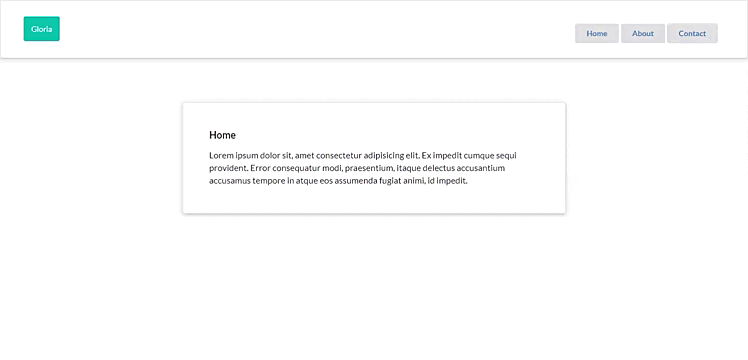

# How to use routes in React JS




# Start Project

With Node JS installed on your computer. At the command prompt, inside the root folder, type ```npm start```

# Opening the project
Open [http://localhost:3000](http://localhost:3000) to view it in your browser.